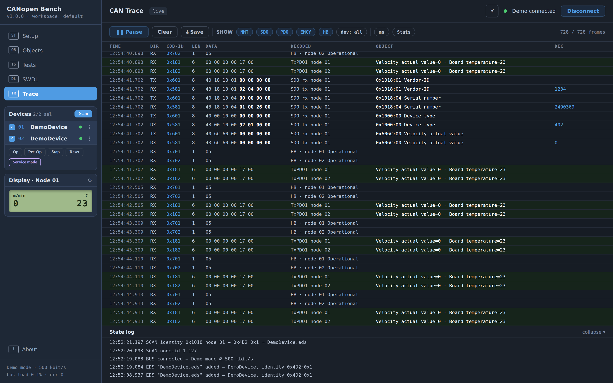
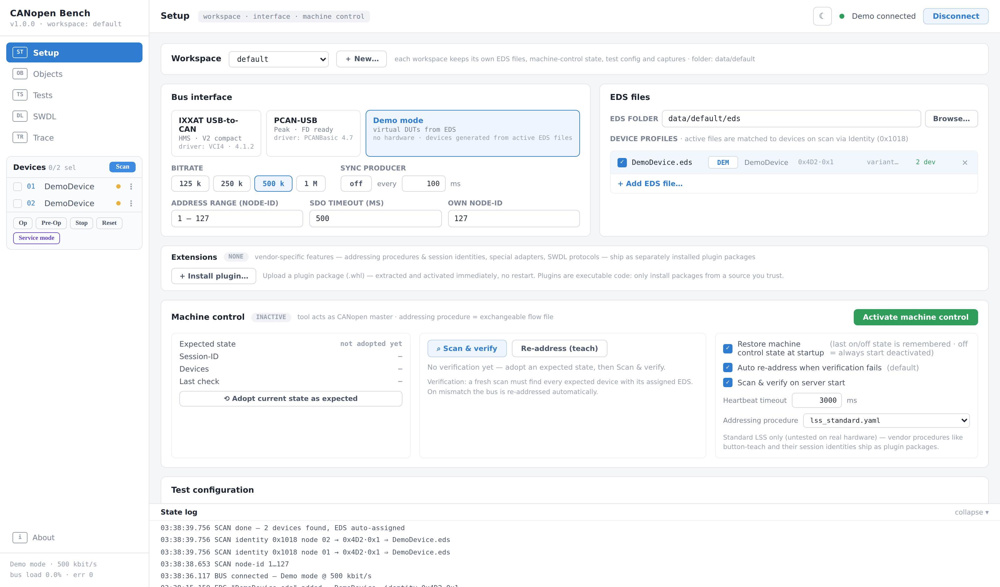

# CANopen Bench

Web tool to test and control CANopen devices on a hardware bench — scan,
object access, system tests, firmware download and a live CAN trace,
driven by the devices' EDS files. Python backend (FastAPI +
canopen/python-can), no-build frontend (Preact/HTM), one self-contained
workspace folder per bench.



## Try it — no hardware needed

```bash
pip install -e .
python -m canopen_bench        # → http://127.0.0.1:8000
```

Pick **Demo mode** on the Setup page, **Connect**, **Scan**: virtual
devices are generated from the bundled `DemoDevice.eds` (installed into
the workspace on first run). SDO reads/writes are answered from the EDS
object dictionary — including realistic aborts on out-of-range writes —
and every access shows up in the Trace like real bus traffic.



## Features

- **Setup** — adapter/bitrate/scan-range, EDS registry with identity
  matching (0x1018), machine control: adopt the bench's expected state,
  scan & verify against it, re-address via exchangeable flow files.
- **Objects** — EDS object browser with read/write, favorites
  (auto-saved), typed RAW rows (SDO / PDO / NMT with per-row node-id),
  last-known values per device serial number.
- **Tests** — declarative YAML test cases
  (`docs/ablaeufe/testfall-format.md`, examples in
  `examples/testcases/`) executed for real against the selected device.
- **SWDL** — firmware download; protocols are manufacturer-specific and
  ship as vendor extension packages (see the note on the page).
- **Trace** — live monitor with class + device filters over a 200k-frame
  ring buffer, ms/µs timestamps, capture save/load.

## Hardware support

| Adapter | Driver | Status |
|---|---|---|
| IXXAT USB-to-CAN | VCI4 (Windows) | supported |
| PCAN-USB | PCANBasic | supported |
| Demo mode | — | no hardware, EDS-driven simulation |
| vendor adapters (e.g. CPC-USB) | via plugin packages | separate install |

## Workspaces

Every subfolder of `./data` (or `$CANOPEN_BENCH_DATA`, e.g. a mounted
Docker volume) is one workspace: its own sqlite db, EDS files, trace
captures and flow files. Create and switch workspaces on the Setup page;
copy a folder to clone or back up a bench. `--db <path>` remains as an
expert override for a single explicit database file.

## Docker

```bash
docker build -t canopen-bench .
docker run -p 8000:8000 -v canopen-bench:/data canopen-bench
```

All workspaces live on the `/data` volume. Demo mode works out of the
box; USB CAN adapters need the device passed through
(`--device=/dev/bus/usb`). The tool has no authentication — keep the
port on a trusted network (see `SECURITY.md`).

## Extending

Vendor- and device-specific functionality (adapter cards, EDS seeds,
firmware catalogs, addressing procedures with session identities, demo
protocol simulations, trace decoders, EMCY code tables, custom
test-step primitives, SWDL strategies) lives in separate pip packages
registered under the
`canopen_bench.plugins` entry-point group — installing one activates it.
In multi-workspace mode this needs no shell at all: Setup > Extensions
installs a plugin package (`.whl`) straight from the browser, active
immediately. Guide with hook table and a minimal example:
`docs/extending.md`; API: `canopen_bench/plugin.py`; a worked public
example (python-can driver + adapter card, GPL-2.0):
[`bench-cpcusb`](https://github.com/NobseVomBerg/CANopen-Bench-GPL-Plugins/tree/main/bench-cpcusb).

## Documentation

- `IMPLEMENTATION.md` — architecture and design decisions
- `CONTRIBUTING.md` — dev setup, test conventions, what goes where
- `docs/extending.md` — plugin guide
- `docs/ablaeufe/` — operational sequence specs (German)
- `docs/ablaeufe/testfall-format.md` — YAML test-case format

## Development

```bash
pip install -e .[dev]
pytest                          # core suite
```

## License & author

Core application: MIT. Vendor extension packages: proprietary.
Created by NobseVomBerg · [unsix.de](https://unsix.de) ·
[GitHub](https://github.com/NobseVomBerg/CANopen-Bench)
